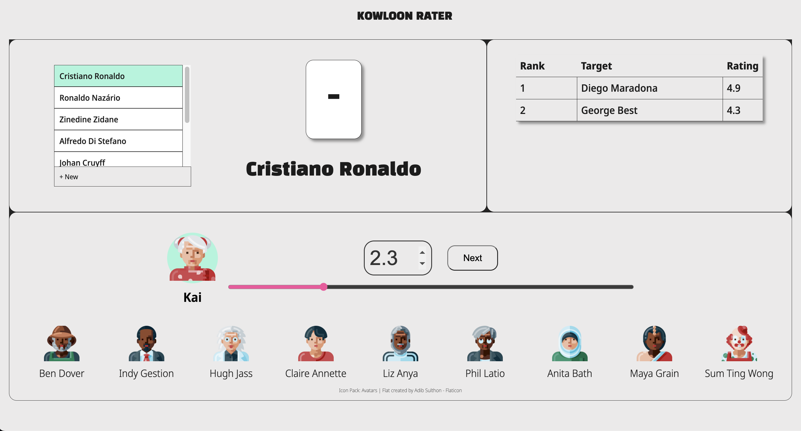

# Kowloon Rater

## Introduction
Kowloon Rater is a fun, interactive game designed primarily for desktop platforms. It's perfect for family gatherings and friend meet-ups, aiming to foster bonding and entertainment. 

## Game Genre
FAMILIES / FRIENDS / FUN
Kowloon Rater is more than just a game; it's a tool for connection, laughter, and understanding. Whether you're with family or friends, it promises to be a delightful addition to your gathering, offering a unique way to interact and bond.

## Game's Objective
In Kowloon Rater, there's no traditional win or lose scenario; the game's primary objective is to help players get to know each other better through a shared and enjoyable activity.

The main goal of Kowloon Rater is to create a relaxed, engaging environment where players rate a list of set targets. This process generates a dynamic ranking, reflecting the group's collective preferences and opinions. It's an excellent way for players to learn about each other's likes, dislikes, and perspectives in a light-hearted setting.

## Rules of the Game
Kowloon Rater features three main boards on the screen:

1. **Rating Board:**
   - Comprises a queue and a rating card.
   - Players can update the queue to add more items, offering flexibility and spontaneity.
   - The rating card displays the current target to be rated, keeping the game focused and organized.

2. **Ranking Board:**
   - Continuously updates the ranking of already rated items.
   - Utilizes the average of all player ratings to form an unbiased and collective ranking.

3. **Member Board:**
   - Acts as a panel for members to take turns and participate in the rating process.
   - Ensures that every player gets an opportunity to contribute to the game.

## Game Mechanics
The primary action in Kowloon Rater is simple yet engaging – players rate items and wait for others to do the same. This simplicity ensures that the game remains accessible and enjoyable for all age groups. Additionally, players have the freedom to add more targets as the game progresses, keeping the experience fresh and adaptable to the group's interests.

## Target Platform
Kowloon Rater is developed with a focus on desktop use. A newer React application version is planned, which will enhance the game's accessibility and user experience.

## Game Screenshot

